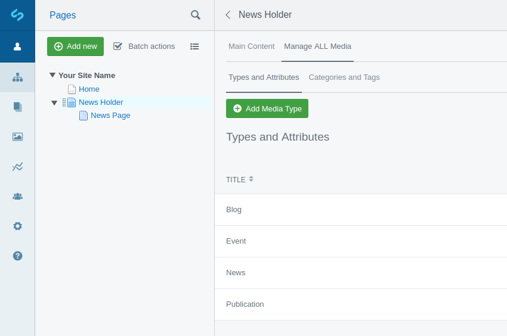
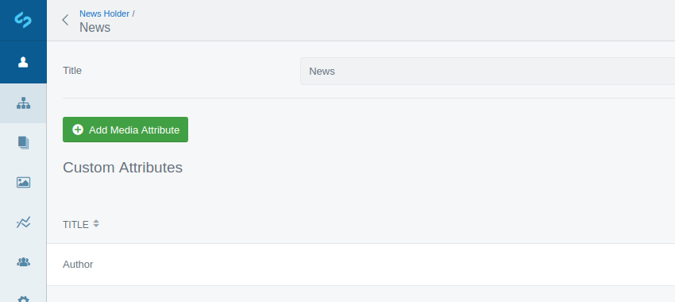
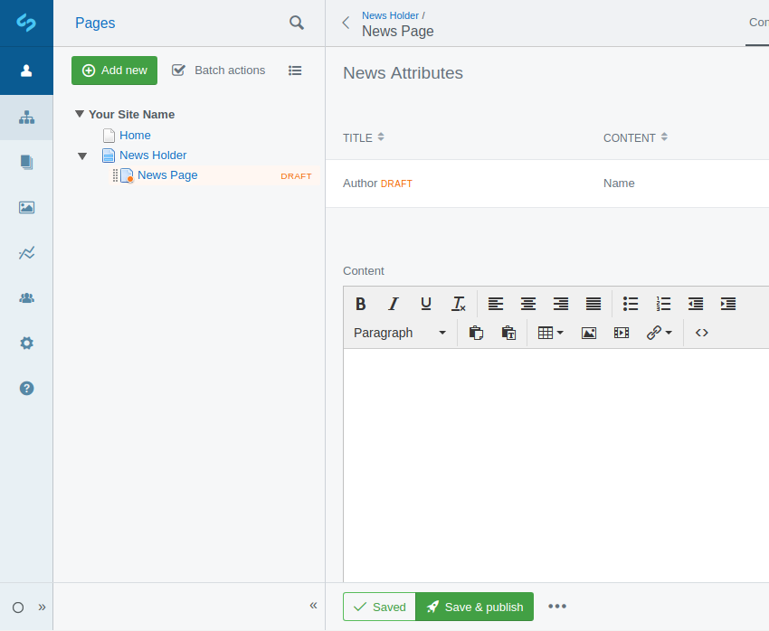
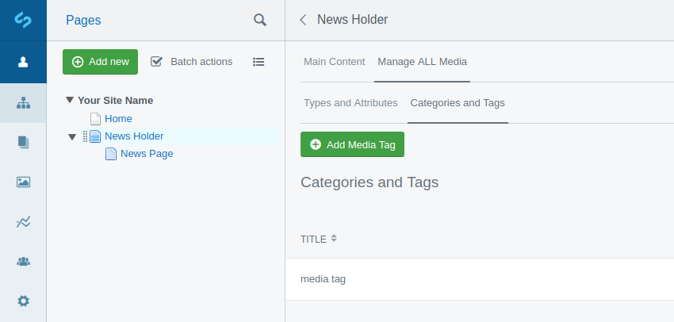
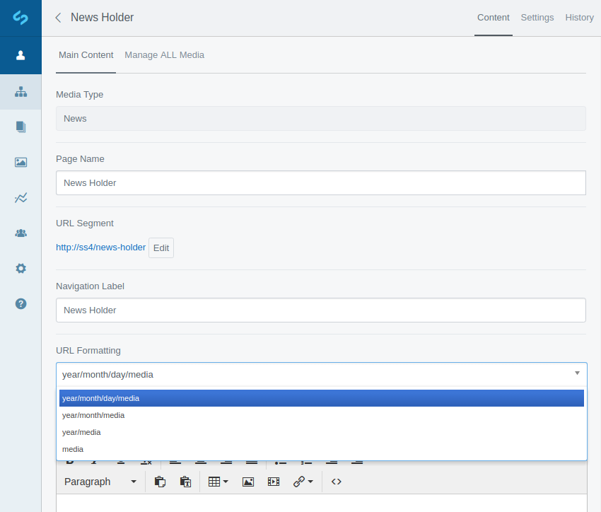

## About

This module allows creation of dynamic media holders/pages with CMS customisable types and attributes (blogs, events, news, publications), including versioning.

## Requirement

* Silverstripe 5+

## Getting Started

Add this repo as an https vcs repository entry.

```sh
composer require nglasl/silverstripe-mediawesome
```

## Overview

### Default Media Types

These are the default media types and their respective attributes.

```yaml
nglasl\mediawesome\MediaPage:
  type_defaults:
    Blog:
      - 'Author'
    Event:
      - 'End Date'
      - 'Time'
      - 'End Time'
      - 'Location'
    News:
      - 'Author'
    Publication:
      - 'Author'
```

Apply custom default media types and/or respective attributes.

```yaml
nglasl\mediawesome\MediaPage:
  type_defaults:
    Type:
      - 'Attribute'
```

These may also be added through the CMS, depending on the current user permissions.



* Select a media holder.
* Select `Manage ALL Media`
* Select `Types and Attributes`

### Dynamic Media Attributes

These may be customised through the CMS, depending on the current user permissions.



* Select a media holder.
* Select `Manage ALL Media`
* Select `Types and Attributes`
* Select the respective type.

These attributes will appear on media pages of the respective type, and are versioned.



### Media Categories and Tags



* Select a media holder.
* Select `Manage ALL Media`
* Select `Categories and Tags`

### CMS Permissions

These may be changed through the site configuration by an administrator.

* Select `Settings`
* Select `Access`

Customisation of media types and their respective attributes will be restricted.

### Filtering Media Pages

A media holder request may have optional date, category and tag filters, which are extendable by developers.

The following on the media holder template allows a user to select a date, and then see media pages for and prior to that date:

```html
{$DateFilterForm}
```

It is also possible to represent the date in a `year/month/day/media` URL format.



### Smart Templating

Custom media type templates may be defined for your media holder/page:

`MediaHolder_Blog.ss` or `MediaPage_Blog.ss`

Retrieve a specific media page attribute in templates:

```html
{$Attribute('Author')}
```

To see examples, look at the default templates:

`MediaHolder.ss` and `MediaPage.ss`

## Maintainer Contact

Nathan Glasl, nathan@symbiote.com.au
